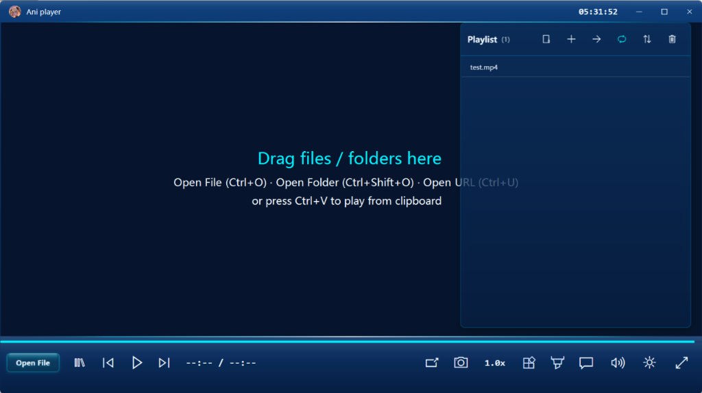
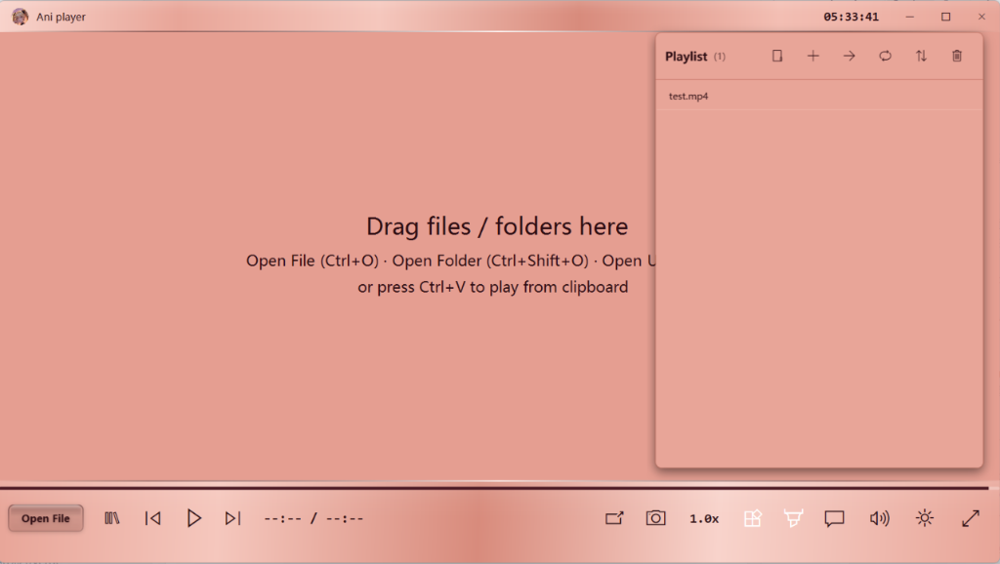
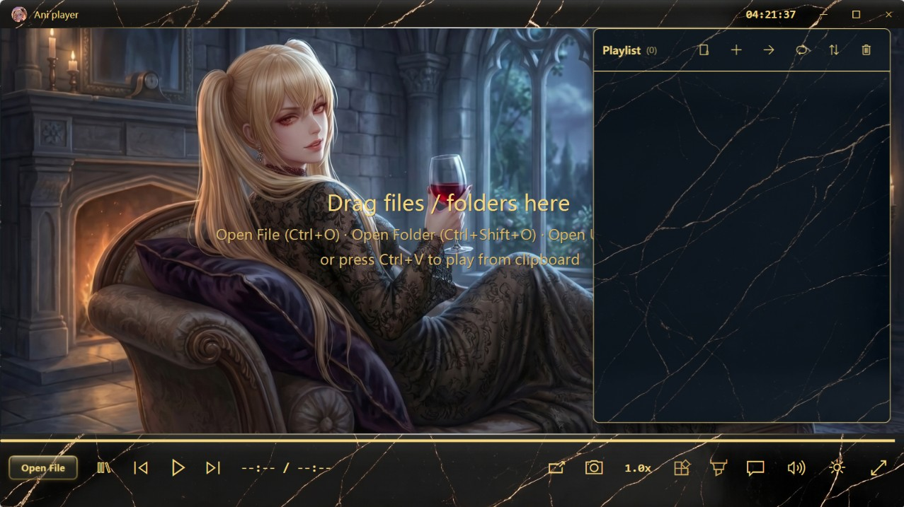
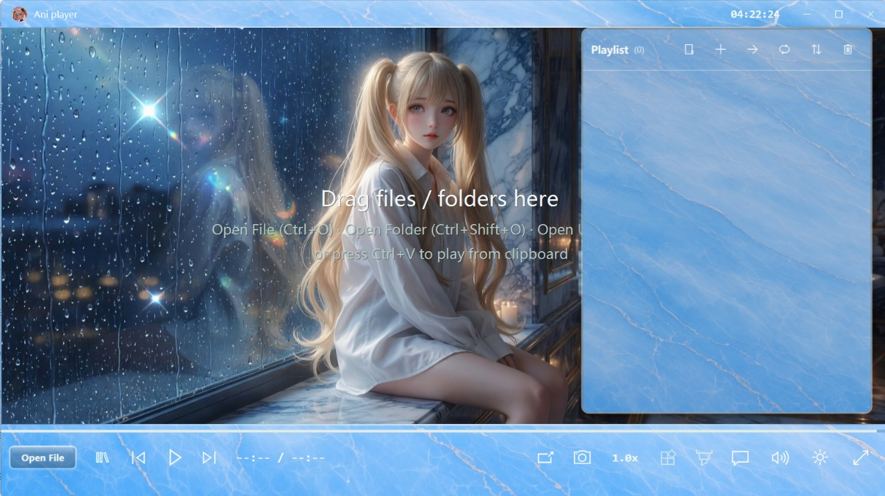
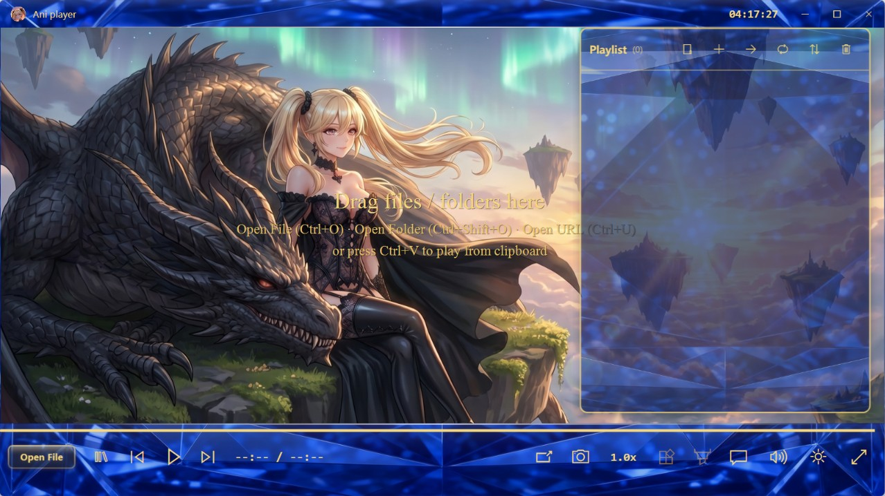
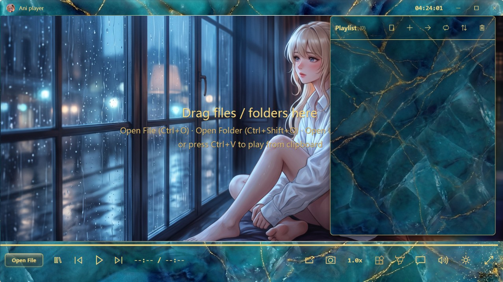

<div align="center">


# 🎬 AniPlayer

### 🌐 [Ani Player - Modern & Minimalist Windows Media Player](https://aniplayer.ai.studio/)

**Modern, Minimalist, Ad-Free Hardware-Accelerated Video & Audio Player for Windows**

[](https://aniplayer.ai.studio/)
[-0078D6.svg?style=flat-square&logo=windows)](https://aniplayer.ai.studio/)
[](https://dotnet.microsoft.com/)
[](https://mpv.io/)
[](./LICENSE)

🏠 **[Official Website](https://aniplayer.ai.studio/)** • 📦 **[Downloads](../../releases)** • 💖 **[Donate](https://aniplayer.ai.studio/)**

</div>

<br/>

> 💭 *Hi, this is my first project published on GitHub.*  
> *I really don't know how things work here -_-. Luckily I have my AI agent to help and guide me.*  
> *I hope you enjoy this media player. It surely took me a lot of time to build!*  
> *I don't have a job and I don't want one anyway. Right now, I'm lying flat in home. *  
> *I have absolutely no idea how to write or build a program like this. The code is completely written by Antigravity. I recorded some of the development process, which I will edit into a video, and post it on YouTube later.*  
> *Only thoroughly tested on Windows 11, though it should be fully compatible with Windows 10 as well.*  
---

## 📸 Interface & Themes Showcase

### 🎨 Eight Built-in Themes
<p align="center">
  
  &nbsp;
  
</p>
<p align="center">
  <em>Left: Default Esports Cyan Theme &nbsp;|&nbsp; Right: Rose Gold Edition</em>
</p>

### 🎭 Custom Skin Packs
<p align="center">
  <a href="Assets/screenshots/black_gold.jpg"></a>
  &nbsp;
  <a href="Assets/screenshots/blue_marble.jpg"></a>
  &nbsp;
  <a href="Assets/screenshots/sapphire.jpg"></a>
  &nbsp;
  <a href="Assets/screenshots/teal_gold.jpg"></a>
</p>
<p align="center">
  <em>Click on any image to view full resolution (Black Gold · Blue Marble · Sapphire · Teal Gold)</em>
</p>

---

## 🌟 Key Features

- 🛡️ **100% Clean, Ad-Free & Privacy-First**: Completely clean with **zero built-in ads, no analytics, no background telemetry, and zero network connections** (network access is strictly used only when you explicitly play online stream URLs or search online subtitles).
- ⚡ **Lightning-Fast Startup**: Ultra-lightweight architecture with instantaneous first-frame playback and minimal memory footprint.
- 🎮 **Industrial-Grade D3D11 / D3D11VA Hardware Acceleration**: Powered by `libmpv` and FFmpeg. Smoothly renders 4K / 8K / HDR / 10-bit HEVC, AV1, H.264, VP9, and WebM with 0 dropped frames.
- 🎨 **Dynamic Skinning & XAML Stylesheet Engine**: Seamlessly switch between built-in themes (Esports Cyan, OLED Pure Black, Emerald Deep Forest) or load custom XAML/JSON skin packs with idle background video playback and ambient BGM.
- 🌐 **Comprehensive Streaming Protocol Support**:
  - **HLS (.m3u8)** with Adaptive Bitrate Streaming (ABR) and separated multi-audio track auto-matching.
  - **MPEG-DASH (.mpd)** and **HTTP-FLV** live streams.
  - **RTSP / RTSPS** IPC security surveillance & **RTMP / RTMPS** broadcast streams.
  - **SRT** broadcast-grade low-latency transport & **UDP / RTP** multicast streaming.
  - Pure RAM ring-buffering with zero SSD wear.
- ✂️ **Intelligent Black Bar Auto-Cropping & Ambient Blur Fill**: Real-time video black bar analysis to automatically detect and crop cinematic letterboxes and subtitle bars, combined with an ambient blurred background stretch mode (Smart Fill) to seamlessly fill display borders.
- 🎵 **Dedicated Vinyl Music Mode**: Audio player with animated turntable needle, LRC/dynamic lyrics parser, and Night Mode dynamic range compression.
- 💬 **Smart Subtitle Engine**: Full ASS/SSA styled subtitles, SRT/VTT, smart local fuzzy matching.
- 🌍 **Full Internationalization (i18n) & Zero Hardcoding**: Native out-of-the-box support for English and Simplified Chinese. 100% of UI strings, tooltip texts, and dialog messages are fully externalized into modular JSON language configuration files (`locales/en-US.json`, `locales/zh-CN.json`). Anyone can easily contribute or translate into new languages without modifying any source code.
- 📦 **Portable & Self-Contained**: No installer required. User configuration and playlists are safely stored in AppData.

---

## 📥 Download & Editions

| Edition | Package File | Size | Recommended Environment |
| :--- | :--- | :---: | :--- |
| **🚀 Windows 11 Lightweight** | **`AniPlayer-v1.0.0-Win11-FrameworkDependent.zip`** | **~49 MB** | **Recommended for Windows 11**. Compact package utilizing OS pre-installed .NET 8 desktop runtime. |
| **🛡️ Self-Contained Standalone** | **`AniPlayer-v1.0.0-Windows-x64-Self-Contained.zip`** | **~111 MB** | **Universal for Windows 10 & 11**. Bundled with complete self-contained .NET 8 runtime & Direct3D accelerators. Zero dependencies. |

### Quick Start
1. Download the desired zip package from [Releases](../../releases);
2. Extract to any folder and double-click `AniPlayer.exe` to run.

### System Requirements
- Windows 10 (Build 1809+) or Windows 11 (64-bit)
- DirectX 11 compatible GPU (Intel HD Graphics, NVIDIA, AMD)

---

## ⌨️ Common Hotkeys

| Hotkey | Description | Alternative |
| :--- | :--- | :--- |
| **`Space`** | Play / Pause | Middle Click / Click Screen |
| **`→` / `←`** | Seek Forward / Backward 5s | Mouse Wheel (Configurable) |
| **`Ctrl + →` / `Ctrl + ←`** | Seek Forward / Backward 30s | - |
| **`↑` / `↓`** | Volume Up / Down (5%) | Mouse Wheel over Volume Slider |
| **`F` / `Double Click`** | Toggle Fullscreen | `Ctrl + Enter` |
| **`M`** | Mute / Unmute | - |
| **`=` / `-`** | Speed Up / Down (0.1x) | - |
| **`Ctrl + O`** | Open File | Drag & Drop File |
| **`Ctrl + Shift + O`** | Open Folder | Drag & Drop Folder |
| **`Ctrl + U`** | Open Stream URL | `Ctrl + V` Paste |
| **`P`** | Toggle Current Playlist | Slide to Right Edge |
| **`L`** | Toggle Media Library | - |
| **`C`** | Smart Blurry Background Fill Mode | - |
| **`X`** | Auto Black Bar Cropping Mode | - |
| **`E`** | Toggle Video Sharpening Filter | - |
| **`Ctrl + S`** | Capture Screenshot (File / Clipboard) | - |
| **`Ctrl + A`** | Toggle A-B Repeat Loop | - |
| **`Ctrl + P`** | Picture-in-Picture (PiP) Floating Window | - |
| **`Ctrl + R`** | Toggle Always On Top | - |
| **`Double Esc`** | Quick Exit | `Alt + F4` |

---

## 🛠️ Building from Source

```powershell
# 1. Clone repository
git clone https://github.com/Winnie-writting-history/AniPlayer.git
cd AniPlayer

# 2. Build development demo
.\build-demo.ps1

# 3. Run self-test suite
dotnet .\Demo\AniPlayer.dll --self-test .\Assets\test.mp4

# 4. Publish standalone release
.\publish-release.ps1

# 5. Create distributable zip archives
.\package-release.ps1
```

---

## 📄 License

AniPlayer is open-sourced under the [GNU General Public License v3.0 (GPLv3)](./LICENSE).
Underlying video playback pipeline is built upon [libmpv](https://mpv.io/) (LGPL v2.1+) and [FFmpeg](https://ffmpeg.org/).
